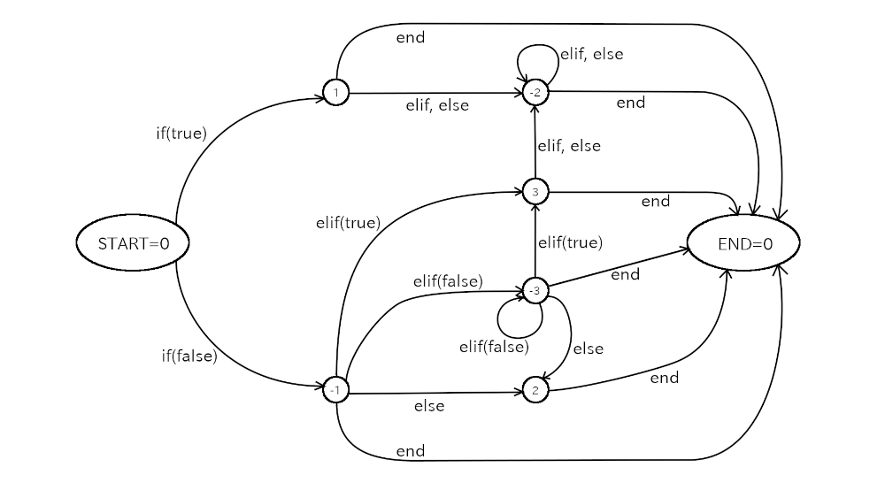

# Construir el Tutorial de Gtk4

## Guía rápida

1. Necesitas el sistema operativo linux, ruby, make, pandoc y latex instalados.
2. Descarga este repositorio y descomprime el archivo.
3. Cambia al directorio superior de los archivos fuente.
4. Escribe `rake html` para crear archivos html. Los archivos se crearán dentro de la carpeta `docs`.
5. Escribe `rake pdf`para crear el pdf. El archivo se creará dentro de la carpeta `latex`.

## Prerequisitos

- Sistema operativo Linux
Los programas de este repositorio han sido probados en Ubuntu 21.04
- Descarga los archivos en el repositorio.
Hay 2 maneras de hacer la descarga.
1. Usar git.
Escribe `git clone https://github.com/cjdg/Gtk4-tutorial-spanish.git` en la línea de comandos.
2. Descargar un archivo zip.
Click en el botón `Code` en la página del repositorio.
Después, click en "Download ZIP".
- Ruby y rake.
- Pandoc. Es usado para convertir archivos markdown a html y/o latex.
- Latex. Textlive2020 o posterior.
Se usa para generar el PDF.

## Markdown Github

Cuando ves el repositorio del [Tutorial Gtk4 en español](https://github.com/cjdg/Gtk4-tutorial-spanish), verás el contenido del archivo `Readme.md`.
Este archivo está escrito en el lenguake Markdown
Los archivos Markdown tienen el sufijo`.md`.

Existen muchas versiones de Markdown.
`Readme.md` usa la versión Github de Markdown (GFM).
Los archivos Markdown en la carpeta `gfm` están escritos en GFM.
Si no estás familiarizado con la GFM, puedes consultar la documentación en [github flavor markdown spec](https://github.github.com/gfm/).

## Markdown pandoc

Este tutorial tambien usa otro tipo de markdown, 'pandoc'.
Pandoc es un convertidor entre markdown, latex, doc, docx, etc.
Este tipo de markdown se usa para convertir markdown a html y/o latex.

## Archivo .Src.md

Los archivos .Src.md tienen el sufijo ".src.md".
La sintaxis de los archivos .src.md  es similar a markdown pero tienen un comando especial que no esta incluido en la sintaxis markdown.
Es el comando @@@.
Este comando inicia una línea con "@@@" y termina con una linea "@@@".
Por ejemplo,

    @@@include
    tfeapplication.c
    @@@

Existen 4 tipos de comando @@@

### @@@include

Este tipo inicia con el comando @@@ con una línea "@@@include"

    @@@include
    tfeapplication.c
    @@@

Este comando reemplaza el texto con el contenido del archivo C entre los comandos `@@@include` y `@@@`.
Si la función precede al nombre de archivo, sólo serán importadas las funciones listadas.

    @@@include
    tfeapplication.c main startup
    @@@

El comando aqui arriba será reemplazado por las funciones `main` y `startup` del archivo `tfeapplication.c`.

Otros lenguajes pueden ser importados también
El siguiente ejemplo importa el archivo  'lib_src2md.rb'

    @@@include
    lib_src2md.rb
    @@@

No se puede insertar funciones que no sean de C.

El texto insertado es convertido para delimitar el bloque de código.
El delimitador del bloque de código comienza con `~~~` y termina con `~~~`
Los contenidos son mostrados tal cual.
`~~~` parece una cerca, por lo que el bloque se llama "cerca de bloque de código"

Si el objetivo markdown es GFM, entonces una cadena de información puede seguir al delimitador inicial.
El siguiente ejemplo muestra como el comando @@@ incluye un archivo fuente C llamado `sample.c`

    $ cat src/sample.c
    int
    main (int argc, char **argv) {
      ... ...
    }
    $cat src/sample.src.md
      ... ...
    @@@include -N
    sample.c
    @@@
      ... ...
    $ ruby src2md.rb src/sample.src.md
    $ cat gfm/sample.md
      ... ...
    ~~~C
    int
    main (int argc, char **argv) {
      ... ...
    }
    ~~~
      ... ...

Las cadenas de información son usualmente languajes como C, ruby, xml, etc.
Esta cadena se procesa con la extensión del archivo.

- `.c`   => C
- `.rb`  => ruby
- `.xml` => xml

Los lenguajes permitidos estan escritos en el método `lang` en `lib/lib_src2md.rb`.

Los números de línea serán insertados arriba de cada línea en el bloque de código.
Si no deseas que se inserten, incluye la opción "-N" al comando @@@include

Opciones

- `-n`: Inserta un número de línea arriba de cada línea (predeterminado).
- `-N`: No se insertan números de línea.

El siguiente ejemplo muestra los números de linea y como son insertados al inicio de cada línea.

    $cat src/sample.src.md
      ... ...
    @@@include
    sample.c
    @@@
      ... ...
    $ ruby src2md.rb src/sample.src.md
    $ cat gfm/sample.md
      ... ...
    ~~~C
     1 int
     2 main (int argc, char **argv) {
      ... ...
    14 }
    ~~~
      ... ...

Si un archivo markdown es un intermediario a uno html, otro tipo de información seguirá el delimitador
Si el comando @@@include no tiene una opción -N, entonces el markdown generado será:

    ~~~{.C .numberLines}
    int
    main (int argc, char **argv) {
      ... ...
    }
    ~~~

La cadena de información `.C` específica lenguaje C.
La cadena de información `.numberLines` es una clase del markdown pandoc.
Si la clase de especifíca, pandoc genera el CSS para insertar los números de líneas al código fuente html.

The info string `.C` specifies C language.
The info string `.numberLines` is a class of the pandoc markdown.
If the class is given, pandoc generates CSS to insert line numbers to the source code in the html file.
That's why the fence code block in the markdown doesn't have line numbers, which is different from gfm markdown.
If `-N` option is given, then the info string is `{.C}` only.

If a markdown is an intermediate file to latex, the same info string follows the beginning fence.

    ~~~{.C .numberLines}
    int
    main (int argc, char **argv) {
      ... ...
    }
    ~~~

Rake uses pandoc with --listings option to convert the markdown to a latex file.
The generated latex file uses 'listings package' to list source files instead of verbatim environment.
The markdown above is converted to the following latex source file.

    \begin{lstlisting}[language=C, numbers=left]
    int
    main (int argc, char **argv) {
      ... ...
    }
    \end{lstlisting}

Listing package can color or emphasize keywords, strings, comments and directives.
But it doesn't really analyze the syntax of the language, so the emphasis tokens are limited.

 @@@include command has two advantages.

1. Less typing.
2. You don't need to modify your .src.md file, even if the C source file is modified.

### @@@shell

This type of @@@ command starts with a line begins with "@@@shell".

    @@@shell
    shell command
     ... ...
    @@@

This command replaces itself with:

- the shell command
- the standard output from the shell command

For example,

    @@@shell
    wc Rakefile
    @@@

This is converted to:

    ~~~
    $ wc Rakefile
    164  475 4971 Rakefile
    ~~~

### @@@if series

This type of @@@ command starts with a line begins with "@@@if", and followed by "@@@elif", "@@@else" or "@@@end".
This command is similar to "#if", "#elif", #else" and "#endif" directives in the C preprocessor.
For example,

    @@@if gfm
    Refer to  [tfetextview API reference](tfetextview_doc.md)
    @@@elif html
    Refer to  [tfetextview API reference](tfetextview_doc.html)
    @@@elif latex
    Refer to tfetextview API reference in appendix.
    @@@end

`@@@if` and `@@@elif` have conditions.
They are `gfm`, `html` or `latex` so far.

- gfm: if the target is GFM
- html: if the target is html
- latex: if the target is pdf.

Other type of conditions may be available in the future version.

The code analyzing @@@if series command is rather complicated.
It is based on the state diagram below.

{width=15cm height=8.4cm}

### @@@table

This type of @@@ command starts with a line begins with "@@@table".
The contents of this command is a table of the GFM or pandoc's markdown.
The command makes a table easy to read.
For example, a text file `sample.md` has a table like this:

    Price list

    @@@table
    |item|price|
    |:---:|:---:|
    |mouse|$10|
    |PC|$500|
    @@@

The command changes this into:

~~~
Price list

|item |price|
|:---:|:---:|
|mouse| $10 |
| PC  |$500 |
~~~

This command just changes the appearance of the table.
There's no influence on html/latex files that is converted from the markdown.
Notice that the command supports only the above type of markdown table format.

A script `mktbl.rb` supports this command.
If you run the script like this:

~~~
$ ruby mktbl.rb sample.md
~~~

Then, the tables in 'sample.md' will be arranged.
The script also makes a backup file `sample.md.bak`.

The task of the script seems easy, but the program is not so simple.
The script `mktbl.rb` uses a library `lib/lib_src2md.rb`

@@@commands are effective in the whole text.
This means you can't stop the @@@commands.
But sometimes you want to show the commands literally like this document.
One solution is to add four blanks at the top of the line.
Then @@@commands are not effective because @@@commands must be at the top of the line.

## Conversion

The @@@ commands are carried out by a method `src2md`,
which is in the file `lib/lib_src2md.rb`.
This method converts `.src.md` file into `.md` file.
In addition, some other conversions are made by `src2md` method.

- Relative links are changed according to the change of the base directory.
- Size option in an image link is removed when the destination is GFM or html.
- Relative link is removed except .src.md files when the destination is html.
- Relative link is removed when the destination is latex.

The order of the conversions are:

1. @@@if
2. @@@table
3. @@@include
4. @@@shell
5. others

There is the `src2md.rb` file in the top directory of this repository.
It just invokes the method `src2md`.
In the same way, the method is called in the action in the `Rakefile`.

## Directory structure

There are seven directories under `gtk4_tutorial` directory.
They are `gfm`, `docs`, `latex`, `src`, `image`, `test` and `lib`.
Three directories `gfm`, `docs` and `latex` are the destination directories for GFM, html and latex files respectively.
It is possible that these three directories don't exist before the conversion.

- src: This directory contains .src.md files and C-related source files.
- image: This directory contains image files like png or jpg.
- gfm: `rake` converts .src.md files to GFM files and store them in this directory.
- docs: `rake html` will convert .src.md files to html files and store them in this directory.
- latex: `rake pdf` will convert .src.md files to latex files and store them in this directory.
Finally it creates a pdf file in `latex` directory.
- lib: This directory includes ruby library files.
- test: This directory contains test files.
The tests are carried out by typing `rake test` on the terminal.

## Src directory and the top directory

Src directory contains .src.md files and C-related source files.
The top directory, which is gtk\_tutorial directory, contains `Rakefile`, `src2md.rb` and some other files.
When `Readme.md` is generated, it will be located at the top directory.
`Readme.md` has title, abstract, table of contents with links to GFM files.

Rakefile describes how to convert .src.md files into GFM, html and/or pdf files.
Rake carries out the conversion according to the `Rakefile`.

## The name of files in src directory

Files in `src` directory are an abstract, sections of the document and other .src.md files.
An `abstract.src.md` contains the abstract of this tutorial.
Each section filename is "sec", number of the section and ".src.md" suffix.
For example, "sec1.src.md", "sec5.src.md" or "sec12.src.md".
They are the files correspond to the section 1, section 5 and section 12 respectively.

## C source file directory

Most of .src.md files have `@@@include` commands and they include C source files.
Such C source files are located in the subdirectories of `src` directory.

Those C files have been compiled and tested.
When you compile source files, some auxiliary files and a target file like `a.out` are created.
Or `_build` directory is made when `meson` and `ninja` is used when compiling.
Those files are not tracked by `git` because they are specified in `.gitignore`.

The name of the subdirectories should be independent of section names.
It is because of renumbering, which will be explained in the next subsection.

## Renumbering

Sometimes you might want to insert a new section.
For example, you want to insert it between section 4 and section 5.
You can make a temporary section 4.5, that is a rational number between 4 and 5.
However, section numbers are usually integer so section 4.5 must be changed to section 5.
And the numbers of the following sections must be increased by one.

This renumbering is done by the `renumber` method in the `lib/lib_renumber.rb` file.

- It changes file names.
- If there are references (links) to sections in .src.md files, the section numbers will be automatically renumbered.

## Rakefile

Rakefile is similar to Makefile but controlled by rake, which is a ruby script.
Rakefile in this tutorial has the following tasks.

- md: generate GFM markdown files. This is the default.
- html: generate html files.
- pdf: generate latex files and a pdf file, which is compiled by lualatex.
- all: generate md, html and pdf files.
- clean: delete latex intermediate files.
- clobber: delete all the generated files.

Rake does renumbering before the tasks above.

## Generate GFM markdown files

Markdown files (GFM) are generated by rake.

    $ rake

This command generates `Readme.md` with `src/abstract.src.md` and titles of each `.src.md` file.
At the same time, it converts each .src.md file into a GFM file under the `gfm` directory.
Navigation lines are added at the top and bottom of each markdown section file.

You can describe width and height of images in .src.md files.
For example,

    {width=10cm height=6cm}

The size between left brace and right brace is used in latex file and it is not fit to GFM syntax.
So the size will be removed in the conversion.

If a .src.md file has relative URL links, they will be changed by conversion.
Because .src.md files are located under the `src` directory and GFM files are located under the `gfm` directory.
That means the base directory of the relative link are different.
For example, `[src/sample.c](sample.c)` is translated to `[src/sample.c](../src/sample.c)`.

If a link points another .src.md file, then the target filename will be changed to .md file.
For example, `[Section 5](sec5.src.md)` is translated to `[Section 5](sec5.md)`.

If you want to clean the directory, that means remove all the generated markdown files, type `rake clobber`.

    $ rake clobber

Sometimes this is necessary before generating GFM files.

    $ rake clobber
    $ rake

For example, if you append a new section and other files are still the same as before, `rake clobber` is necessary.
Because the navigation of the previous section of the newly added section needs to be updated.
If you don't do `rake clobber`, then it won't be updated because the the timestamp of .md file in gfm is newer than the one of .src.md file.
In this case, using `touch` to the previous section .src.md also works to update the file.

If you see the github repository (ToshioCP/Gtk4-tutorial), `Readme.md` is shown below the code.
And `Readme.md` includes links to each markdown files.
The repository not only stores source files but also shows the whole tutorial.

## Generate html files

Src.md files can be translated to html files.
You need pandoc to do this.
Most linux distribution has pandoc package.
Refer to your distribution document to install it.

Type `rake html` to generate html files.

    $ rake html

First, it generates pandoc's markdown files under `docs` directory.
Then, pandoc converts them to html files.
The width and height of image files are removed.
Links to .src.md files will be converted like this.

    [Section 5](sec5.src.md) => [Section 5](sec5.html)

Image files are copied to `docs/image` direcotiry and links to them will be converted like this:

    [sample.png](../image/sample.png) => [sample.png](image/sample.png)

Other relative links will be removed.

`index.html` is the top html file.
If you want to clean html files, type `rake clobber` or `cleanhtml`.

    $ rake clobber

Every html file has a header (`<head> -- </head>`).
It is created by pandoc with '-s' option.
You can customize the output with your own template file for pandoc.
Rake uses `lib/lib_mk_html_template.rb` to create its own template.
The template inserts bootstrap CSS and Javascript through `jsDelivr`.

The `docs` directory contains all the necessary html files.
They are used in the [github pages](https://ToshioCP.github.io/Gtk4-tutorial) of this repository.

So if you want to publish this tutorial on your own web site, just upload the files in the `docs` directory to your site.

## Generate a pdf file

You need pandoc to convert markdown files into latex source files.

Type `rake pdf` to generate latex files and finally make a pdf file.

    $ rake pdf

First, it generates pandoc's markdown files under `latex` directory.
Then, pandoc converts them into latex files.
Links to files or directories are removed because latex doesn't support them.
However, links to full URL and image files are kept.
Image size is set with the size between the left brace and right brace.

    {width=10cm height=6cm}

You need to specify appropriate width and height.
It is almost `0.015 x pixels` cm.
For example, if the width of an image is 400 pixels, the width in a latex file will be almost 6cm.

A file `main.tex` is the root file of all the generated latex files.
It has `\input` commands, which inserts each section file, between `\begin{document}` and `\end{document}`.
It also has `\input`, which inserts `helper.tex`, in the preamble.
Two files `main.tex` and `helper.tex` are created by `lib/lib_gen_main_tex.rb`.
It has a sample markdown code and converts it witn `pandoc -s`.
Then, it extracts the preamble in the generated file and puts it into `helper.tex`.
You can customize `helper.tex` by modifying `lib/lib_gen_main_tex.rb`.

Finally, lualatex compiles the `main.tex` into a pdf file.

If you want to clean `latex` directory, type `rake clobber` or `rake cleanlatex`

    $ rake clobber

This removes all the latex source files and a pdf file.
